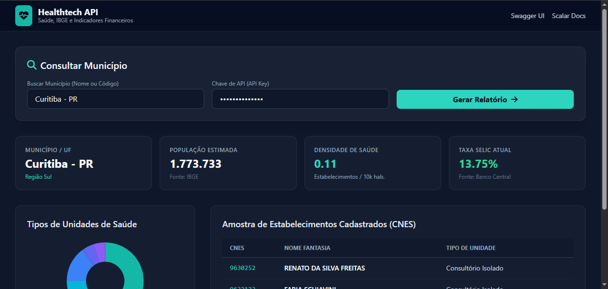

# Healthtech API Unificada (Saúde, IBGE e Financeiro)

### Testar online:

Como testar agora mesmo:
Aceder à Documentação Interativa (Swagger UI):
Abra o link no seu navegador:

👉 https://healthtech-ripb.onrender.com/





API RESTful desenvolvida em Python com **FastAPI** que consolida indicadores demográficos do IBGE, estatísticas em tempo real de estabelecimentos de saúde (DataSUS/CNES), taxas macroeconômicas (Banco Central do Brasil) e métricas calculadas de densidade de saúde por habitante.

---

### Tecnologias Utilizadas

- **Python 3.12+**
- **FastAPI**: Framework web assíncrono de alta performance.
- **HTTPX**: Cliente HTTP assíncrono para consumo paralelo de APIs terceiras.
- **Uvicorn**: Servidor ASGI de produção.
- **Python-dotenv**: Gestão segura de variáveis de ambiente.
- **uv**: Gestor de pacotes e ambientes Python de nova geração.

---

### Funcionalidades

- **Validação Geográfica**: Validação e consumo de dados territoriais via API de Localidades do IBGE.
- **Indicadores Financeiros**: Consulta em tempo real da Taxa SELIC acumulada via API SGS do Banco Central.
- **Estatísticas de Saúde CNES**:
  - Mapeamento e tradução automática dos tipos de unidade do DataSUS (ex: *Consultório Isolado*, *Hospital Geral*, *CAPS*).
  - Listagem de estabelecimentos cadastrados no município.
- **Métricas Analíticas**:
  - Densidade populacional de saúde (*Estabelecimentos de saúde por 10.000 habitantes*).
- **Autenticação por API Key**: Proteção de rotas via parâmetros de segurança configuráveis por ambiente (`.env`).

---

### Estrutura do Projeto

```text
healthtech/
├── src/
│   └── healthtech/
│       ├── __init__.py
│       └── main.py
├── .env.example
├── .gitignore
├── pyproject.toml
├── README.md
└── uv.lock
```

---

### Como Executar o Projeto Localmente

### 1. Clonar o repositório

```
git clone [https://github.com/area-41/healthtech.git](https://github.com/area-41/healthtech.git)

cd healthtech
```

### 2. Configurar o Ambiente Virtual e Dependências
Utilizando o `uv`:
```
uv sync
```

### 3. Configurar Variáveis de Ambiente
Crie um ficheiro `.env` baseado no `.env.example`:
```env
API_SECRET_KEY=demo_token_123
ENVIRONMENT=development
```

### 4. Executar a Aplicação
```bash
uv run uvicorn src.healthtech.main:app --reload
```

Acesse a documentação interativa (Swagger UI) em:  
👉 `http://127.0.0.1:8000/docs`

---

### Exemplo de Requisição e Resposta

**End-point:**
`GET /api/v1/relatorio-municipio/3550308?api_key=demo_token_123`

**Exemplo de Payload de Resposta:**
```json
{
  "status": "sucesso",
  "data": {
    "municipio": {
      "codigo_ibge": "3550308",
      "nome": "São Paulo",
      "uf": "SP",
      "regiao": "Sudeste",
      "populacao_estimada": 12396372
    },
    "indicadores_macroeconomicos": {
      "fonte": "Banco Central do Brasil",
      "taxa_selic_atual": "10.75%"
    },
    "indicadores_saude_cnes": {
      "fonte": "DataSUS / CNES - Ministério da Saúde",
      "total_estabelecimentos_consultados": 20,
      "densidade_saude": {
        "estabelecimentos_por_10k_hab": 0.02
      },
      "distribuicao_tipos_unidade": {
        "Consultório Isolado": 15,
        "Clínica / Centro Especializado": 5
      },
      "amostra_estabelecimentos": [
        {
          "cnes": "9631070",
          "nome_fantasia": "CONS ODONTO ANA PAULA SANTOS DE MORAES SOUZA",
          "tipo_unidade": "Consultório Isolado"
        }
      ]
    }
  }
}
```


### Preparar para Deploy:

    uv pip compile pyproject.toml -o requirements.txt

        Resolved 18 packages in 364ms
        This file was autogenerated by uv via the following command:

            uv pip compile pyproject.toml -o requirements.txt
        annotated-doc==0.0.5
        annotated-types==0.8.0
        anyio==4.15.1
        certifi==2026.7.22
        click==8.5.0
        fastapi==0.142.1
        h11==0.16.0
        httpcore==1.0.9
        httpx==0.28.1
        idna==3.20
        opentelemetry-api==1.45.0
        pydantic==2.13.5
        pydantic-core==2.46.5
        python-dotenv==1.2.3
        starlette==1.7.0
        typing-extensions==4.16.0
        typing-inspection==0.4.4
        uvicorn==0.54.0


### Healthtech 
Combinar dados de Saúde (DataSUS / Ministério da Saúde), Demográfica, Indicadores Sociais (IBGE) e Finanças (Banco Central / Cotações) em uma única API.


### Instalando UV FastAPI:

        uv add fastapi

Resolved 12 packages in 1.23s
Prepared 6 packages in 967ms
Uninstalled 1 package in 11ms
Installed 12 packages in 387ms

 + annotated-doc==0.0.5
 + annotated-types==0.8.0
 + anyio==4.15.1
 + fastapi==0.142.1
 + healthtech==0.1.0 (from file://)
 + idna==3.20
 + opentelemetry-api==1.45.0
 + pydantic==2.13.5
 + pydantic-core==2.46.5
 + starlette==1.7.0
 + typing-extensions==4.16.0
 + typing-inspection==0.4.4


 ### Instalando HTTPx:

        uv add httpx

Resolved 16 packages in 1.46s                               
Prepared 1 package in 144ms
Uninstalled 1 package in 6ms
Installed 5 packages in 1.09s
 + certifi==2026.7.22
 + h11==0.16.0
 + healthtech==0.1.0 (from file://)
 + httpcore==1.0.9
 + httpx==0.28.1


 ### Instalando Unicorn

        uv add fastapi uvicorn

Resolved 18 packages in 283ms
Prepared 2 packages in 143ms
Uninstalled 1 package in 12ms
Installed 3 packages in 89ms
 + click==8.5.0
 + healthtech==0.1.0 (from file://)
 + uvicorn==0.54.0

 ### Iniciar o servidor API:

        uv run uvicorn main:app --reload

### Instalar .env para Keys:

        uv add python-dotenv

Resolved 19 packages in 249ms
Prepared 1 package in 42ms
Uninstalled 1 package in 5ms
Installed 2 packages in 136ms
 + healthtech==0.1.0 (from file:/)
 + python-dotenv==1.2.3


Rodar novamente a API:

    uv run uvicorn main:app --reload


### Instalando o Streamlit:

        uv add streamlit plotly

Resolved 49 packages in 1.32s
Prepared 15 packages in 11.81s
Uninstalled 1 package in 12ms
Installed 31 packages in 3.90s
 + altair==6.3.0
 + attrs==26.1.0
 + charset-normalizer==3.5.2
 + healthtech==0.1.0 (from file://)
 + httptools==0.8.0
 + itsdangerous==2.2.0
 + jinja2==3.1.6
 + jsonschema==4.26.0
 + jsonschema-specifications==2025.9.1
 + markupsafe==3.0.3
 + narwhals==2.26.0
 + numpy==2.5.3
 + packaging==26.3
 + pandas==3.0.6
 + pillow==12.3.0
 + plotly==7.1.0
 + protobuf==7.36.2
 + pyarrow==25.0.1
 + pydeck==0.9.3
 + python-dateutil==2.9.0.post0
 + python-multipart==0.0.32
 + referencing==0.37.0
 + requests==2.34.2
 + rpds-py==2026.6.3
 + six==1.17.0
 + streamlit==1.64.0
 + toml==0.10.2
 + tzdata==2026.4
 + urllib3==2.8.0
 + watchdog==6.0.0
 + websockets==16.1.1

 ### CacheTools Apscheduler

        uv add cachetools apscheduler

Resolved 52 packages in 2.71s     
Prepared 3 packages in 577ms
Uninstalled 1 package in 13ms
Installed 4 packages in 170ms
 + apscheduler==3.11.3
 + cachetools==7.2.0
 + healthtech==0.1.0 (from file://)
 + tzlocal==5.4.4